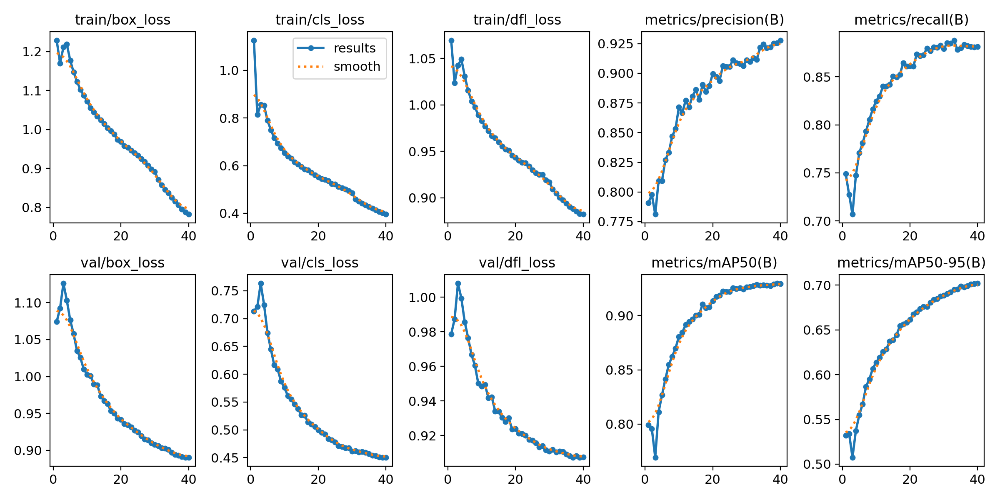
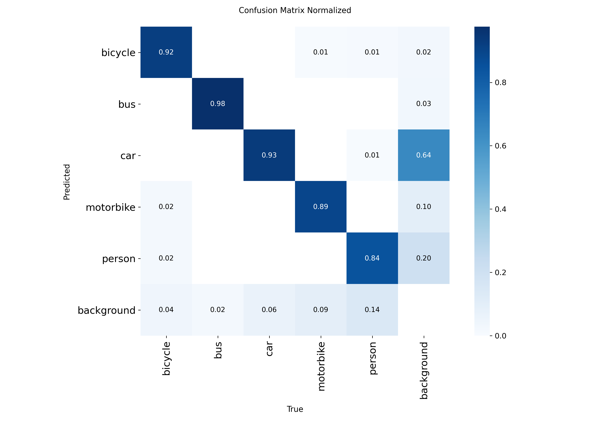
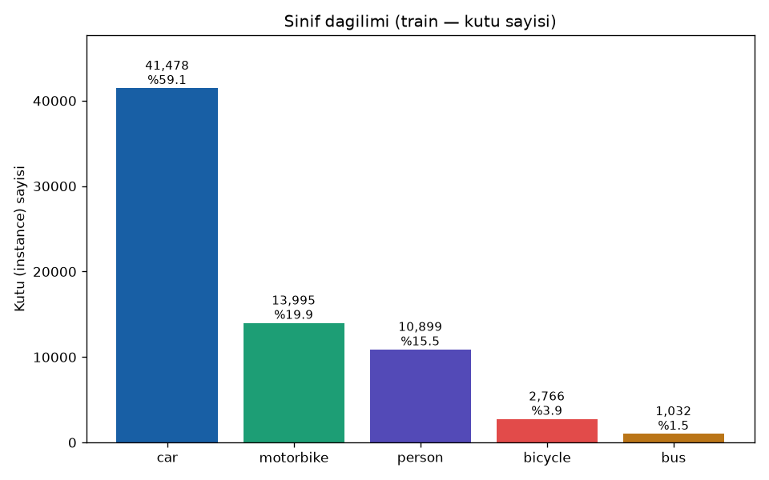
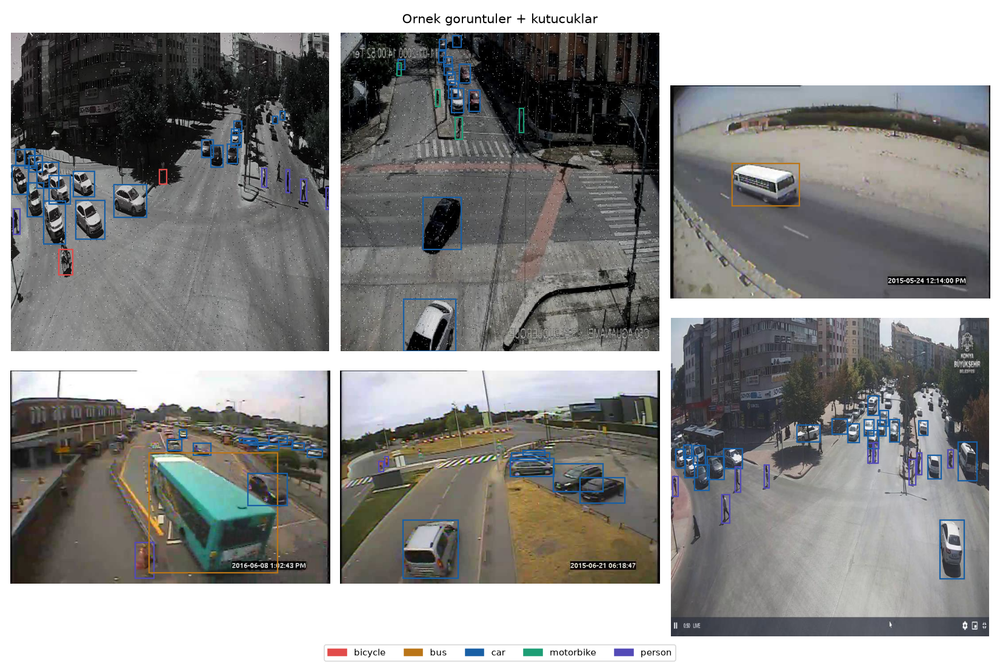
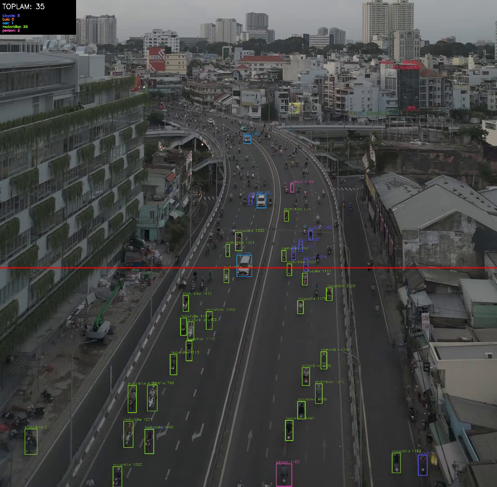

# Trafik Nesne Tespiti + Sayma

> 🇬🇧 **English summary** — Traffic object detection and counting: YOLOv8s trained on a custom ~18k-image multi-angle dataset (street CCTV + a MIO-TCD subset), ByteTrack tracking, and a Streamlit demo with automatic tuning (confidence threshold, sky cropping, counting-line placement) plus direction-aware line-crossing counts. Validation mAP50 0.929. Portfolio/learning project.

Trafik görüntülerinde/videolarında araç ve yaya tespiti yapan, videoda araçları takip edip **sayan** bir bilgisayarlı görü projesi. YOLOv8 ile eğitildi, ByteTrack ile takip ediyor, Streamlit ile demo arayüzü var.

Sınıflar: `bicycle, bus, car, motorbike, person`. Öğrenme amaçlı bir portföy projesi.


## Ne yapıyor

İki mod var:

- **Görüntü:** bir fotoğraftaki nesneleri tespit edip sınıf sınıf sayar.
- **Video:** ByteTrack ile her nesneye kimlik (ID) verip takip eder; ekrana konan bir **sayım çizgisini** geçenleri bir kez sayar. Çizgiden geçenler **yön ayrımıyla** raporlanır; ayrıca o ana kadar görülen benzersiz nesne sayısı da tutulur.

Demo pratik olsun diye birkaç şeyi kendisi hallediyor:

- **Otomatik ayar:** güven eşiği, üst kırpma (gökyüzü/binayı atıp yola odaklanma) ve çözünürlük videodan otomatik seçilir. İstersen hepsini elle de ayarlarsın.
- **Sayım çizgisi:** varsayılan olarak trafiğin en yoğun aktığı yere otomatik yerleşir; istersen kare üstünde **iki noktaya tıklayarak** kendin koyarsın (yatay/dikey/eğik).
- **Hız modları:** CPU'da uzun videolar yavaş olduğu için kare atlama seçeneği var (2'de 1 / 3'te 1); ilerleme çubuğu tahmini kalan süreyi gösterir.

## Sayımın doğruluğu için yapılanlar

Naif "çizginin hangi tarafında" yaklaşımı yerine birkaç önlem aldım; çünkü ilk sürümlerde aynı araç tekrar tekrar sayılabiliyordu:

- **Parça-parça kesişim:** nesnenin hareketi, çizginin *doğrusunu* değil bizzat *parçasını* kesmeli. Kısa bir çizgi çekersen uzantısından geçenler sayılmaz.
- **Geniş takip tamponu** (`bytetrack_takip.yaml`, track_buffer=90): nesne birkaç kare gizlense de aynı ID'de kalır → yeni ID + tekrar sayım azalır.
- **Asgari ömür filtresi:** 5 kareden kısa yaşayan izler (genelde gürültü/ID-atlama) toplam sayaca girmez.
- Her ID en fazla bir kez sayılır.

## Veri

İki kaynağı birleştirdim (~18k görüntü, çok açılı):

- Sokak/CCTV açısından çekilmiş bir trafik veri seti (Kaggle, YOLO formatında)
- **MIO-TCD Localization** (Miovision Traffic Camera Dataset) — trafik kamerası açısı; `3_mio_donustur.py` 11 sınıfı bizim 5 sınıfa eşleyip YOLO formatına çevirir, nadir sınıfları (bicycle/bus/motorbike/person) önceleyerek dengeli bir alt küme seçer

Birleştirilmiş eğitim setini Kaggle'a yükledim: `mustafaardadoan/trafik-birlesik`

## Eğitim ve sonuçlar

Eğitim Kaggle T4 GPU'sunda, iki aşamada:

1. **Baseline** (`2_egitim.py`): YOLOv8n, 20 epoch — "hat çalışıyor mu?" denemesi.
2. **Genel model** (`5_genel_egitim.py`): YOLOv8s, 40 epoch, birleşik veri — demo'nun kullandığı model.

Genel modelin doğrulama sonuçları (40. epoch, `results.csv`'den):

| Metrik | Değer |
|---|---|
| mAP50 | **0.929** |
| mAP50-95 | 0.702 |
| Precision | 0.928 |
| Recall | 0.881 |



Sınıflar arasında en güçlüsü `bus`, en zayıfı `person` çıktı — sebep sınıf dengesizliği değil, nesnelerin ayırt edilebilirliği (otobüs büyük ve belirgin, yaya küçük ve çeşitli). Detay confusion matrix'te:



## Dosyalar (boru hattı sırasıyla)

```
1_kesif.py             veri keşfi (EDA): bölünme, sınıf dağılımı, örnek kutular
1b_etiket_kontrol.py   etiket kalitesi göz kontrolü (sınıf başına örnek kırpımlar)
2_egitim.py            baseline eğitim — YOLOv8n, 20 epoch (Kaggle)
3_mio_donustur.py      MIO-TCD -> YOLO format dönüştürücü (dengeli alt küme seçer)
4_birlestir.py         iki veri setini tek YOLO veri setinde birleştirir
5_genel_egitim.py      asıl modelin eğitimi — YOLOv8s, 40 epoch (Kaggle)
6_takip_sayma.py       komut satırı takip + sayma (ilk sürüm — basit yatay çizgi)
7_demo.py              Streamlit demo (görüntü + video, tüm gelişmiş özellikler)
bytetrack_takip.yaml   ayarlı ByteTrack konfigürasyonu
ornekler/              demo için örnek görüntüler
ciktilar/              örnek çıktılar ve eğitim kanıtları (README görselleri)
```

Not: `6_takip_sayma.py` projenin ilk sayım denemesidir ve basit yatay-çizgi mantığını kullanır; gelişmiş sayım (parça kesişimi, yön ayrımı, ömür filtresi) `7_demo.py`'dedir.

Veri hazırlama scriptleri yolları argümanla alır, örneğin:

```bash
python 1_kesif.py --veri <yolo-veri-koku>
python 3_mio_donustur.py --mio <MIO-TCD-klasoru> --cikti mio_yolo
python 4_birlestir.py --archive <archive> --mio mio_yolo --cikti birlesik
```

## Çalıştırma

```bash
pip install -r requirements.txt
streamlit run 7_demo.py
```

Model ağırlıkları (`model/genel_best.pt`, ~22 MB) ve veri setleri repoya konmadı; model `5_genel_egitim.py` ile yeniden eğitilebilir (istenirse paylaşırım). Demo, ağırlık dosyasını `model/` klasöründe arar ve yoksa açık bir mesajla söyler.

Örnek video da repoda yok — demo kendi videonu yüklemenle çalışır (mp4/avi/mov). Yukarıdan/açılı çekilmiş yol videoları en iyi sonucu verir.

## Dürüst notlar

- CPU'da işlem yavaştır: 1080p videoda kabaca 4 kare/sn (imgsz 1280). Hız modları bunun için var; kare atlama ~2 kat hızlandırır ama seyrek de olsa bir geçişi kaçırabilir.
- Modelin recall'ı sahneye göre değişiyor: yoğun/uzak trafikte nesne kaçırabiliyor. Yüksek çözünürlük + kırpma + düşük eşik bunu ölçülür şekilde iyileştirdi (+%22–33 tespit), ama sınır modelin kendisinde.
- Sayım çizgisi mantığı ID kararlılığına bağlı: nesne çok uzun süre tamamen kapanırsa yeni ID alır ve tekrar sayılabilir. Takip tamponu bunu azaltır, sıfırlamaz.

## Örnek çıktılar

| Sınıf dağılımı (EDA) | Tespit örnekleri |
|---|---|
|  |  |


